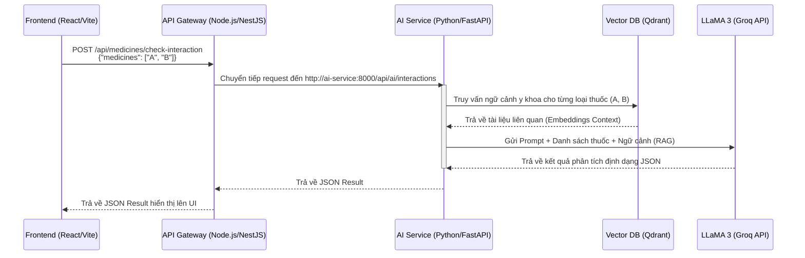

# Pipeline API Kiểm tra Tương tác Thuốc (AI-Driven)

Tài liệu này mô tả chi tiết luồng xử lý (pipeline) đằng sau tính năng **Kiểm tra Tương tác Thuốc bằng AI**, từ lúc người dùng nhấn nút trên giao diện cho đến khi nhận được kết quả phân tích y khoa.

---

## 1. Kiến trúc luồng dữ liệu (Data Pipeline)

Luồng hoạt động của API đi qua 3 thành phần chính:



### Chi tiết các bước:
1. **Frontend**: Gom danh sách các loại thuốc người dùng nhập và gọi API thông qua Vite Proxy để tránh lỗi CORS.
2. **API Gateway (NestJS)**: Đóng vai trò làm trạm trung chuyển, xác thực request (đảm bảo mảng có >= 2 loại thuốc) và forward request sang AI Service nội bộ.
3. **AI Service (FastAPI)**:
   - **RAG Retrieval**: Gọi xuống cơ sở dữ liệu Vector (Qdrant) để lấy thông tin y khoa liên quan (Dược động học, chống chỉ định) của từng loại thuốc. Nhờ vậy AI không "bịa" thông tin (hallucination).
   - **LLM Generation**: Tổng hợp ngữ cảnh thu được từ Qdrant + danh sách thuốc -> Gửi Prompt cho LLaMA 3 qua nền tảng Groq để siêu tốc độ phản hồi. LLaMA 3 được ép buộc trả về đúng cấu trúc JSON chuẩn.

---

## 2. Đặc tả API

### Endpoint (Từ góc độ Frontend)
- **URL**: `POST /api/medicines/check-interaction`
- **Headers**: `Content-Type: application/json`
- **Body**:
  ```json
  {
    "medicines": ["tên thuốc 1", "tên thuốc 2", "..."]
  }
  ```

### Response Schema
API luôn trả về một JSON có cấu trúc cố định để giao diện có thể parse và render:
```json
{
  "has_interactions": boolean,
  "severity": "Cao" | "Trung bình" | "Thấp" | "An toàn",
  "interactions": [
    {
      "drug_a": "Tên thuốc A",
      "drug_b": "Tên thuốc B",
      "description": "Mô tả tác hại/tương tác",
      "recommendation": "Lời khuyên y khoa"
    }
  ],
  "general_advice": "Lời khuyên tổng quan về toa thuốc"
}
```

---

## 3. Các ví dụ (Examples)

### Ví dụ 1: Tương tác cảnh báo mức độ Trung bình / Cao
**Request:**
```json
{
  "medicines": ["Paracetamol", "Aspirin"]
}
```

**Response (Minh họa):**
```json
{
  "has_interactions": true,
  "severity": "Trung bình",
  "interactions": [
    {
      "drug_a": "Paracetamol",
      "drug_b": "Aspirin",
      "description": "Tương tác giữa Paracetamol và Aspirin có thể làm tăng nguy cơ tổn thương gan và xuất huyết tiêu hóa do cả hai đều tác động lên hệ thống đông máu và chức năng gan nếu dùng chung liều cao.",
      "recommendation": "Tránh dùng chung nếu không có chỉ định đặc biệt của bác sĩ. Nếu cần giảm đau, nên chọn một trong hai thay vì kết hợp."
    }
  ],
  "general_advice": "Bệnh nhân có tiền sử loét dạ dày cần đặc biệt lưu ý khi sử dụng đơn thuốc này."
}
```

### Ví dụ 2: Toa thuốc an toàn (Không phát hiện tương tác)
**Request:**
```json
{
  "medicines": ["Vitamin C", "Paracetamol"]
}
```

**Response (Minh họa):**
```json
{
  "has_interactions": false,
  "severity": "An toàn",
  "interactions": [],
  "general_advice": "Không phát hiện tương tác nguy hiểm nào giữa các loại thuốc này. Có thể sử dụng chung an toàn theo đúng liều lượng khuyến cáo."
}
```

### Ví dụ 3: Các chất kích thích / Phi y tế
**Request:** (Trường hợp bạn vừa test)
```json
{
  "medicines": ["Cần sa", "Thuốc lá"]
}
```

**Response (Minh họa):**
```json
{
  "has_interactions": true,
  "severity": "Cao",
  "interactions": [
    {
      "drug_a": "Cần sa",
      "drug_b": "Thuốc lá",
      "description": "Việc kết hợp cần sa và thuốc lá (hút chung) làm tăng đáng kể lượng carbon monoxide và hắc ín hít vào, gây tổn thương phổi nghiêm trọng hơn so với dùng đơn lẻ, đồng thời làm tăng nguy cơ mắc các bệnh tim mạch.",
      "recommendation": "Tuyệt đối không nên kết hợp. Cần tư vấn cai nghiện và kiểm tra chức năng hô hấp định kỳ."
    }
  ],
  "general_advice": "Sử dụng các chất kích thích này gây suy giảm hệ miễn dịch và chức năng hô hấp. Bệnh nhân cần được tư vấn cai bỏ."
}
```

---

> [!TIP]
> Việc tích hợp Qdrant (RAG - Retrieval-Augmented Generation) giúp AI cập nhật được các tương tác thuốc mới nhất dựa trên tài liệu y khoa trong Database nội bộ, thay vì chỉ dựa vào kiến thức huấn luyện có sẵn của LLaMA 3. Điều này đảm bảo tính chính xác cao hơn cho môi trường Y tế.
