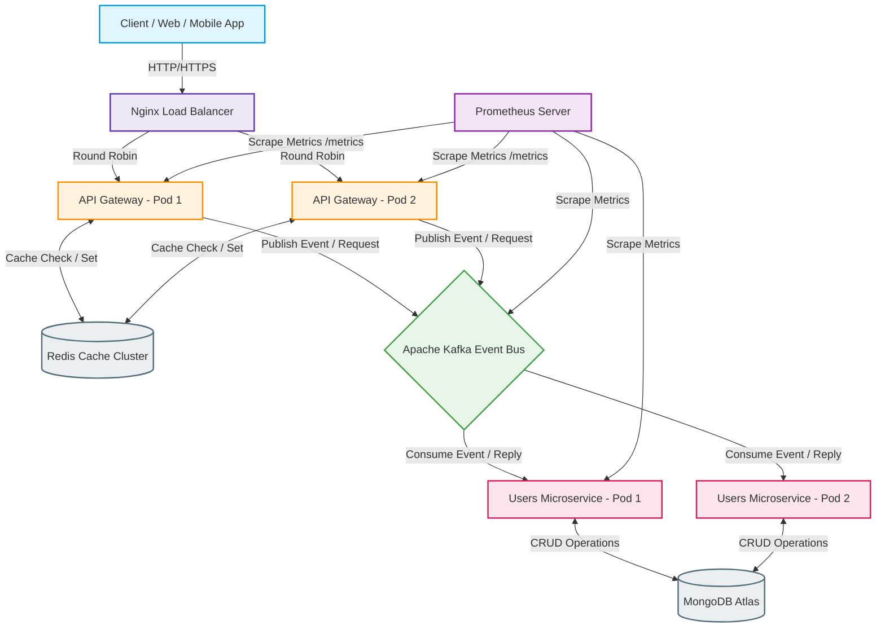
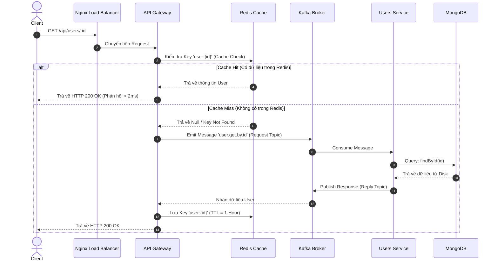
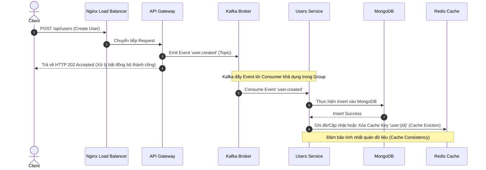
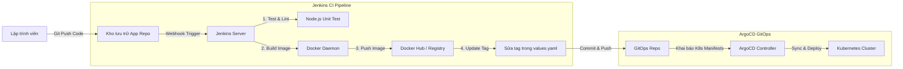

# Kiến Trúc Hệ Thống Vi Dịch Vụ Hướng Sự Kiện (Event-Driven Microservices Architecture)
## Hệ Thống WDP301 Enterprise Platform

Tài liệu này mô tả chi tiết kiến trúc kỹ thuật toàn diện cho hệ thống WDP301, chuyển đổi từ mô hình đơn khối (Monolith) sang kiến trúc **Event-Driven Microservices** sử dụng **Apache Kafka**, **Redis Cache Layer**, **Nginx Load Balancer**, và hệ thống giám sát **Prometheus**.

---

## 1. Sơ Đồ Tổng Quan Kiến Trúc (Architecture Topology)

Hệ thống được tổ chức thành các tầng tách biệt nhằm tối ưu hóa tính độc lập, hiệu năng chịu tải cao và khả năng khôi phục sau sự cố.



---

## 2. Luồng Dữ Liệu Chi Tiết (Data Flow Sequences)

### A. Luồng Đọc Dữ Liệu (Read Query Flow - Cache-Aside Pattern)
Mô hình này giúp giảm thiểu tối đa các truy vấn trực tiếp vào database bằng cách ưu tiên lấy từ bộ nhớ đệm tốc độ cao.



### B. Luồng Ghi Dữ Liệu (Write Transaction Flow - Event-Driven)
Luồng xử lý ghi áp dụng kiến trúc bất đồng bộ (Asynchronous) giúp Client nhận phản hồi ngay lập tức, trong khi hệ thống chạy xử lý ngầm ở phía sau.



---

## 3. Thành Phần Hệ Thống & Vai Trò (System Component Directory)

| Thành phần | Công nghệ sử dụng | Cấu hình & Vai trò chính |
| :--- | :--- | :--- |
| **Load Balancer** | Nginx | Điều phối tải (Round Robin), xử lý SSL Termination, định tuyến API Gateway. Expose cổng `80` và `443`. |
| **API Gateway** | NestJS REST API | Điểm truy cập HTTP duy nhất. Xác thực (JWT Auth), kiểm tra/ghi Cache (Redis Store), xuất bản các event lên Kafka. Không chứa logic nghiệp vụ và không kết nối trực tiếp DB. |
| **Message Broker** | Apache Kafka (KRaft mode) | Kênh phân phối sự kiện (Event Bus). Lưu trữ bền vững các tin nhắn, đảm bảo hệ thống lỏng lẻo (loose coupling) và có thể mở rộng xử lý song song thông qua Partitioning. |
| **Cache Layer** | Redis | Bộ nhớ đệm InMemory lưu trữ thực thể (User, Session). Sử dụng chiến lược Cache-Aside và TTL (Time to Live) để tự động làm mới tài nguyên. |
| **Microservices** | NestJS Microservice | Dịch vụ chuyên biệt (như `users-service`). Nhận thông điệp từ Kafka, thực hiện xử lý nghiệp vụ nặng, tương tác trực tiếp với Database. |
| **Database** | MongoDB Atlas | Hệ quản trị cơ sở dữ liệu phi quan hệ, lưu trữ lâu dài thông tin thực thể với hiệu năng ghi cao. |
| **Monitoring** | Prometheus & Grafana | Thu thập tài nguyên hệ thống (Prometheus Scraper) qua endpoint `/metrics` của API Gateway và vẽ biểu đồ trực quan (Grafana). |

---

## 4. Cấu Hình Triển Khai Hệ Thống (Infrastructure Code)

### A. Nginx Load Balancer Cấu Hình (`docker/nginx.conf`)
```nginx
user nginx;
worker_processes auto;
error_log /var/log/nginx/error.log warn;
pid /var/run/nginx.pid;

events {
    worker_connections 1024;
}

http {
    include /etc/nginx/mime.types;
    default_type application/octet-stream;

    upstream gateway_cluster {
        server api-gateway-1:3000 max_fails=3 fail_timeout=10s;
        server api-gateway-2:3000 max_fails=3 fail_timeout=10s;
        keepalive 32;
    }

    server {
        listen 80;
        server_name api.wdp301.local;

        location / {
            proxy_pass http://gateway_cluster;
            proxy_http_version 1.1;
            proxy_set_header Connection "";
            proxy_set_header Host $host;
            proxy_set_header X-Real-IP $remote_addr;
            proxy_set_header X-Forwarded-For $proxy_add_x_forwarded_for;
            proxy_set_header X-Forwarded-Proto $scheme;
            
            # Khắc phục lỗi Timeout cho các request dài
            proxy_connect_timeout 60s;
            proxy_send_timeout 60s;
            proxy_read_timeout 60s;
        }

        # Expose endpoint phục vụ giám sát Prometheus
        location /metrics {
            proxy_pass http://gateway_cluster/metrics;
            access_log off;
        }
    }
}
```

### B. Docker Compose Môi Trường Cục Bộ (`docker-compose.yml`)
```yaml
version: '3.8'

services:
  # Nginx Load Balancer
  nginx:
    image: nginx:alpine
    container_name: wdp301-nginx
    ports:
      - "80:80"
    volumes:
      - ./docker/nginx.conf:/etc/nginx/nginx.conf:ro
    depends_on:
      - api-gateway-1
      - api-gateway-2
    networks:
      - wdp301-network

  # Redis Cache
  redis:
    image: redis:7-alpine
    container_name: wdp301-redis
    ports:
      - "6379:6379"
    command: redis-server --save 60 1 --loglevel warning
    networks:
      - wdp301-network

  # Apache Kafka (Kraft - Không cần Zookeeper)
  kafka:
    image: confluentinc/cp-kafka:7.4.0
    container_name: wdp301-kafka
    ports:
      - "9092:9092"
    environment:
      KAFKA_NODE_ID: 1
      KAFKA_LISTENER_SECURITY_PROTOCOL_MAP: 'CONTROLLER:PLAINTEXT,PLAINTEXT:PLAINTEXT,PLAINTEXT_HOST:PLAINTEXT'
      KAFKA_ADVERTISED_LISTENERS: 'PLAINTEXT://kafka:29092,PLAINTEXT_HOST://localhost:9092'
      KAFKA_OFFSETS_TOPIC_REPLICATION_FACTOR: 1
      KAFKA_GROUP_INITIAL_REBALANCE_DELAY_MS: 0
      KAFKA_PROCESS_ROLES: 'broker,controller'
      KAFKA_CONTROLLER_QUORUM_VOTERS: '1@kafka:29093'
      KAFKA_LISTENERS: 'PLAINTEXT://0.0.0.0:29092,CONTROLLER://0.0.0.0:29093,PLAINTEXT_HOST://0.0.0.0:9092'
      KAFKA_INTER_BROKER_LISTENER_NAME: 'PLAINTEXT'
      KAFKA_CONTROLLER_LISTENER_NAMES: 'CONTROLLER'
      KAFKA_LOG_DIRS: '/tmp/kraft-combined-logs'
      CLUSTER_ID: 'MkU3OEVBNTcwNTJENDM2Qk'
    networks:
      - wdp301-network

  # API Gateway Instances
  api-gateway-1:
    image: wdp301-api-gateway:latest
    environment:
      - PORT=3000
      - REDIS_HOST=redis
      - KAFKA_BROKERS=kafka:29092
    networks:
      - wdp301-network

  # API Gateway Instances 2
  api-gateway-2:
    image: wdp301-api-gateway:latest
    environment:
      - PORT=3000
      - REDIS_HOST=redis
      - KAFKA_BROKERS=kafka:29092
    networks:
      - wdp301-network

  # Users Microservice Instances
  users-service:
    image: wdp301-users-service:latest
    environment:
      - KAFKA_BROKERS=kafka:29092
      - MONGODB_URI=mongodb://mongodb:27017/wdp301
      - REDIS_HOST=redis
    networks:
      - wdp301-network

networks:
  wdp301-network:
    driver: bridge
```

---

## 5. Pipeline CI/CD & Luồng GitOps (ArgoCD)



### Các giai đoạn (Stages) chính của CI/CD:
1. **Kiểm tra mã nguồn (Checkout & Test):** Jenkins tải mã nguồn từ repo về, chạy đồng thời `npm run lint` và `npm test` cho cả `api-gateway` và `users-service`.
2. **Xây dựng Docker Images (Build Image):** Jenkins đóng gói 2 file Dockerfile tương ứng với 2 dịch vụ, đặt tag ảnh theo định dạng: `<commit-hash>` và `latest`.
3. **Quét bảo mật (Security Scan):** Sử dụng công cụ **Trivy** để kiểm tra mã độc và các lỗ hổng thư viện trong image vừa build.
4. **Đẩy ảnh lên Registry (Push Image):** Đẩy images đã đóng gói thành công lên Docker Hub hoặc AWS ECR.
5. **Cập nhật GitOps Repo:** Tự động sửa cấu hình tệp `values-override.yaml` (dành cho Helm Chart) trong repository gitops để khai báo tag ảnh mới nhất.
6. **Tự động đồng bộ hóa (ArgoCD Synchronization):** ArgoCD phát hiện sự thay đổi trong cấu hình GitOps, kích hoạt tiến trình Rolling Update trên Kubernetes Cluster để thay đổi các pod mà hoàn toàn không gây gián đoạn dịch vụ (Zero Downtime Deployment).

---

> [!NOTE]
> Bản thiết kế kiến trúc này đảm bảo tính chịu tải cao và khả năng khôi phục nhanh chóng cho toàn bộ hệ thống. Mọi thiết lập hạ tầng có thể triển khai cục bộ (Docker Compose) hoặc môi trường production (Kubernetes/EKS).
